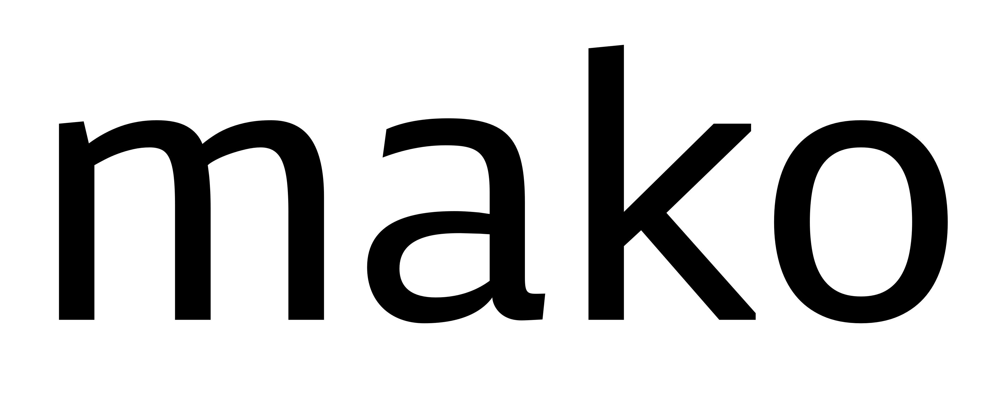

# Mako Font Project
by Vernon Adams

## Mako

Mako is a minimal sans serif designed to be used freely across the internet by web browsers on desktop computers, laptops and mobile devices.

## Designer

* Vernon Adams

## License

Licensed under the [SIL Open Font License, 1.1](http://scripts.sil.org/OFL); you may only use these files in compliance with the License.

To contribute to the project, file an issue at https://github.com/googlefonts/Michroma-font